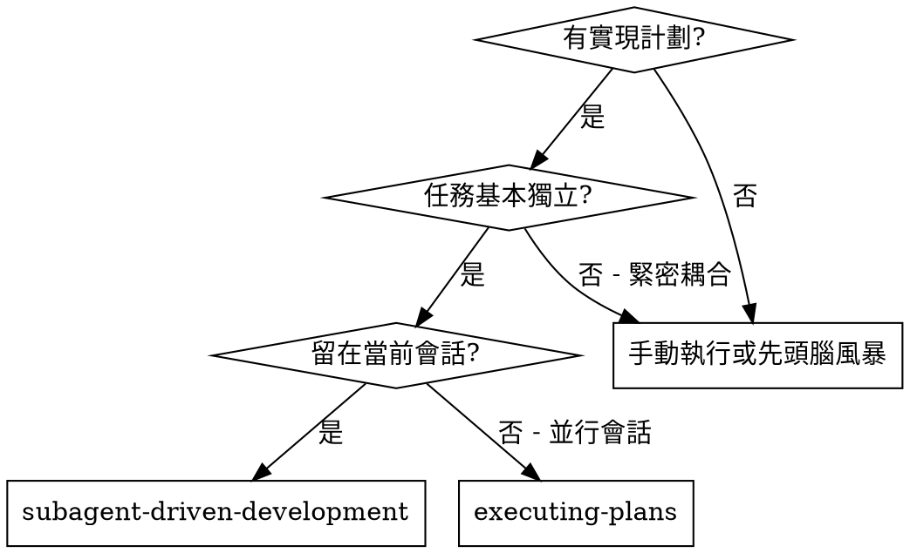
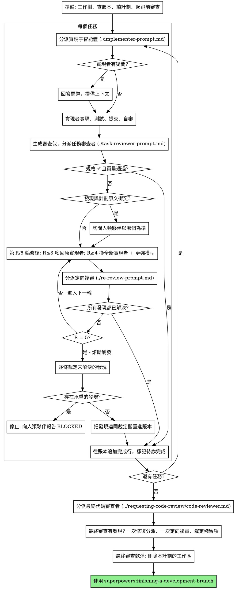

# 子智能體驅動開發

通過為每個任務分派一個全新的實現子智能體來執行計劃：每個任務完成後做一次任務審查（規格合規性 + 代碼質量），全部任務結束後再做一次覆蓋整個分支的寬範圍審查。

**為什麼用子智能體：** 你把任務委派給具有隔離上下文的專用智能體。通過精心設計它們的指令和上下文，確保它們專注併成功完成任務。它們絕不應繼承你會話的上下文或歷史記錄——你要精確構造它們所需的一切。這樣也能為你自己保留用於協調工作的上下文。

**核心原則：** 每個任務一個全新子智能體 + 任務審查（規格 + 質量）+ 結尾寬範圍審查 = 高質量、快速迭代

**旁白：** 工具調用之間最多說一句簡短的旁白——進度賬本和工具結果本身就是記錄。

**持續執行：** 不要在任務之間停下來向你的人類夥伴確認。不間斷地執行計劃裡的所有任務。唯一該停下的理由是：你無法解決的 BLOCKED 狀態、確實妨礙推進的歧義，或所有任務已完成。"我該繼續嗎？"之類的詢問和進度小結都在浪費他們的時間——他們讓你執行計劃，那就執行。

## 何時使用



**與 Executing Plans（並行會話）的對比：**
- 同一會話（無上下文切換）
- 每個任務全新子智能體（無上下文汙染）
- 每個任務後做審查（規格合規性 + 代碼質量），結尾做寬範圍審查
- 更快的迭代（任務間無需人工介入）

## 流程



## 準備

確保工作發生在一個隔離的工作區裡：用 superpowers:using-git-worktrees 創建一個，或者核實已有的那個。沒有你人類夥伴的明確同意，絕不在 main/master 分支上開始實現。

會話記憶無法在上下文壓縮（compaction）中存活。在真實會話裡，丟失了位置的控制者曾重新分派整段已經完成的任務序列——這是觀察到的最昂貴的失敗。把進度記在一個賬本文件裡，而不只是記在待辦裡。

- **每個計劃擁有自己的工作區：** 技能啟動時，運行本技能的 `scripts/sdd-workspace PLAN_FILE`——它會打印這個計劃專屬的、被 git 忽略的目錄（`<repo-root>/.superpowers/sdd/<計劃文件名>/`），**本計劃**的一切產物都放在那裡：賬本、簡報、報告、審查包。別的計劃的目錄不屬於你，不讀也不寫。
- 到 `<工作區>/progress.md` 查本計劃的賬本。如果它的第一行點名的是你的計劃文件，那麼帶有 `Task <N>: complete` 行的任務就是**已完成**——不要重新分派它們；從第一個沒有該行的任務處繼續。如果某個任務的最後一行是一輪修復，說明它正卡在修復循環中：從下一輪繼續。如果賬本第一行點名的是**另一個**計劃文件——或者你在舊的扁平路徑 `.superpowers/sdd/progress.md` 發現了一個遊離的賬本——那是別人的進度：原地別動，另起你自己的新賬本。
- 創建賬本時，把它的身份寫在第一行：`# SDD ledger — plan: <計劃文件路徑>`。
- 這個賬本是你的恢復地圖：它點名的那些提交，即使你的上下文已經不記得創建過它們，也確實存在於 git 中。壓縮之後，相信賬本和 `git log`，而不是你自己的記憶。
- `git clean -fdx` 會毀掉這個工作區（它是被 git 忽略的臨時文件）；萬一發生了，就從 `git log` 恢復。

把計劃**讀一遍**，記下它的上下文和全局約束，併為每個任務建一條待辦。

在分派任務 1 之前，把計劃通掃一遍找衝突：

- 互相矛盾的任務，或與計劃的"全局約束"矛盾的任務
- 計劃明確要求、但審查標準會判為缺陷的東西（比如一個什麼都不斷言的測試、一整塊邏輯的逐字複製）

把你找到的所有問題**一次性打包成一個問題**呈現給你的人類夥伴——每條發現都並列上要求它的那段計劃原文，問以哪個為準——在執行開始之前問，而不是執行過程中每發現一個就打斷一次。如果掃描是乾淨的，就不要多說，直接開始。審查循環仍然是那些只有在實現中才浮現的衝突的兜底網。

## 模型選擇

在能勝任的前提下，為每個角色選用最弱的模型，以節省成本、提升速度。

**機械性實現任務**（孤立的函數、清晰的規格、1-2 個文件）：用快而便宜的模型。計劃寫得好時，大多數實現任務都是機械性的。

**集成與判斷類任務**（跨文件協調、模式匹配、調試）：用標準模型。

**架構與設計類任務**：用可用的最強模型。覆蓋整個分支的最終審查就屬於這一類——用可用的最強模型去分派它，不要用會話默認模型。

**審查任務**：用同樣的判斷來選模型，並按 diff 的體量、複雜度和風險來縮放。一個小的機械性 diff 不需要最強模型；一個微妙的併發改動需要。小修復 diff 的定向複審用便宜到中檔的層級即可。

**修復循環的升級（第 4-5 輪）**：用比那個卡住了的實現者**至少高一檔**的模型。

**分派子智能體時永遠顯式指定模型。** 省略模型會繼承你會話的模型——往往是最強也最貴的那個——這會悄無聲息地讓本節的努力全部失效。

**輪次數比 token 單價更要緊。** 牆鍾時間和上下文成本是隨子智能體花掉多少輪次而增長的，而最便宜的模型在多步工作上經常要花 2-3 倍輪次——總賬反而更貴。審查者、以及依據散文式描述工作的實現者，都以中檔模型為下限。當任務的計劃原文裡已經包含了要寫的完整代碼時，實現就是抄寫加測試：這種實現者用最便宜的層級。單文件的機械性修復也用最便宜的層級。

**任務複雜度信號（實現類任務）：**
- 涉及 1-2 個文件且規格完整 → 便宜模型
- 涉及多個文件且有集成考量 → 標準模型
- 需要設計判斷或對代碼庫的廣泛理解 → 最強模型

## 任務循環

你粘進分派提示詞裡的一切、以及子智能體打印回來的一切，都會在本次會話餘下的時間裡常駐你的上下文，並且在之後每一輪被重新讀一遍。**產物要用文件來交接。**

### 1. 分派實現者

分派之前記錄 BASE（`git rev-parse HEAD`）——審查包和各輪修復的 diff 都要用它。

- **任務簡報：** 分派實現者之前，運行本技能的 `scripts/task-brief PLAN_FILE N`——它把該任務的完整文本抽取到一個唯一命名的文件並打印路徑。組織你的分派，讓這份簡報保持為需求的唯一來源。你的分派應包含：(1) 一行說明這個任務在項目中的位置；(2) 簡報路徑，引入語為"先讀這個——它是你的需求，裡面有要逐字使用的精確取值"；(3) 簡報無從知曉的、來自前序任務的接口和決策；(4) 你對簡報中注意到的任何歧義的裁定；(5) 報告文件路徑和報告契約。精確取值（數字、魔法字符串、簽名、測試用例）只出現在簡報裡。**絕不**讓子智能體去讀整個計劃文件。
- **報告文件：** 實現者的報告文件按簡報來命名（簡報 `…/task-N-brief.md` → 報告 `…/task-N-report.md`），並寫進分派提示詞。實現者把完整報告寫在那裡，只回傳狀態、提交、一行測試小結和疑慮。
- 一個分派提示詞描述的是**一個任務**，不是會話的歷史。不要把累積的前序任務小結（"任務 1-3 之後的狀態"）粘進後面的分派——真實會話裡曾出現過 42k 字符的分派，其中 99% 是粘貼的歷史。一個全新的子智能體需要的是：它的任務、它要碰的接口、以及全局約束。別無其他。
- 如果前面某個任務把一條發現擱置在本任務要碰的區域，就在分派裡帶上指向那條賬本記錄的指針。
- **記下分派結果裡實現者的智能體身份**——第 1-3 輪修復要喚回這個智能體。
- 絕不併行分派多個實現子智能體（會衝突）。

模板：[implementer-prompt.md](implementer-prompt.md)

### 2. 處理報告

實現子智能體會回傳四種狀態之一。分別處理：

**DONE：** 生成審查包（在本技能目錄下運行 `scripts/review-package PLAN_FILE BASE HEAD`——它會打印出自己寫入的那個唯一文件路徑；BASE 是你在分派實現者之前記錄下來的那個提交——**絕不用** `HEAD~1`，那會悄悄丟掉多提交任務裡除最後一個之外的所有提交），然後把打印出的路徑交給任務審查者去分派。

**DONE_WITH_CONCERNS：** 實現者完成了工作但提出了疑慮。繼續之前先讀這些疑慮。如果疑慮關乎正確性或範圍，在審查之前先處理掉。如果只是觀察（比如"這個文件變大了"），記下來，繼續走審查。

**NEEDS_CONTEXT：** 實現者需要沒被提供的信息。補上缺失的上下文並重新分派。

**BLOCKED：** 實現者無法完成任務。評估這個阻塞：
1. 如果是上下文問題，補充上下文並用同一個模型重新分派
2. 如果任務需要更多推理，用更強的模型重新分派
3. 如果任務太大，拆成更小的塊
4. 如果是計劃本身錯了，上報給人類

**絕不**忽視一次上報，也**絕不**在什麼都沒改的情況下強迫同一個模型重試。如果實現者說它卡住了，那就一定有東西需要改變。

如果實現者提問——不論是開始前還是任務中途——清楚完整地回答，需要時補充上下文，不要催著它進入實現。

### 3. 審查任務

逐任務審查是**任務範圍內的關卡**。寬範圍審查只做一次，在最終的整分支審查那裡。絕不跳過任務審查，也絕不接受一份缺少任一結論的報告——規格合規性**和**任務質量兩者都必須有。實現者的自審永遠不能替代任務審查；兩者都需要。

- **把 diff 作為文件交給審查者：** 運行本技能的 `scripts/review-package PLAN_FILE BASE HEAD`，把它打印出的文件路徑交給審查者（若沒有 bash：對該區間跑 `git log --oneline`、`git diff --stat`、`git diff -U10`，重定向到一個唯一命名的文件）。這些輸出永遠不會進入你自己的上下文，而審查者在一次 Read 調用裡就能看到提交列表、stat 摘要和帶上下文的完整 diff。用你在分派實現者之前記錄下的 BASE——**絕不用** `HEAD~1`，那會悄悄截斷多提交任務。**絕不**在沒有 diff 文件的情況下分派任務審查者。
- **審查者的輸入：** 任務審查者拿到三個路徑——同一份簡報文件、報告文件、審查包——外加約束該任務的全局約束。
- 你交給審查者的全局約束塊是它的**注意力透鏡**。從計劃的"全局約束"一節或規格裡**逐字**抄下有約束力的需求：精確的取值、精確的格式，以及組件之間被明確規定的關係（"與 X 相同的佈局"、"匹配 Y"）。審查者的模板裡已經帶了流程規則（YAGNI、測試衛生、審查方法）——約束塊是用來裝**這個項目**的規格所要求的東西的。
- 不要在沒有具體的、任務專屬的理由時，加上"檢查所有用法"或"有用的話跑一下競態測試"這類開放式指令
- 不要讓審查者重跑實現者已經在同一份代碼上跑過的測試——實現者的報告承載著測試證據
- **不要替審查者預先給發現定性**——絕不指示審查者忽略或不要標記某個具體問題。如果你認為某條發現會是誤報，讓審查者提出來，然後在審查循環裡裁定它。如果你正在寫的提示詞裡出現了"不要標記"、"不要把 X 當缺陷"、"頂多按 Minor 處理"、"計劃選擇了"——停下：你正在預先定性，而且通常是為了讓自己少走一輪審查循環。

任務審查者可能報告"⚠️ 無法從 diff 核實"的條目——那些活在未改動代碼裡、或者跨任務的需求。這些不阻塞審查的其餘部分，但在標記任務完成之前**你必須自己逐條解決它們**：你掌握著審查者所缺的計劃和跨任務上下文。如果你確認某一條是真實的缺口，就把它當作規格審查失敗來處理——它和其他發現一起進入修復循環。

模板：[task-reviewer-prompt.md](task-reviewer-prompt.md)

### 4. 修復循環

當審查報告規格 ❌、任何 Critical 或 Important 發現、或者你確認為真實缺口的 ⚠️ 條目時，循環觸發。

循環開始之前，有兩條路會立刻離開它：

- **Minor 發現**隨手記進進度賬本（`Task <N>: minor (deferred): <一句話>`），並把最終的整分支審查指向那份清單，讓它去甄別哪些必須在合併前修掉。**沒人讀的彙總等於靜默丟棄。** Minor 發現永遠不進入循環。
- 被標為"計劃要求的"發現——或任何與計劃原文所要求的內容衝突的發現——和任何計劃矛盾一樣，屬於**人類的決定**：把這條發現和那段計劃原文一起呈現，問以哪個為準。不要因為計劃要求就駁回這條發現，也不要在沒問過的情況下分派一個與計劃相違的修復。

其他一切都進入循環。**一輪修復 = 一次修復分派 + 一次定向複審。每個任務最多五輪。**

**第 1-3 輪——喚回原來那個實現者（resume）。** 把未解決的發現**逐字**發給它。它的上下文是完整的：它知道任務、知道代碼、知道自己做過的選擇。如果你的運行環境無法給一個活著的子智能體再發消息，就分派一個全新實現者，帶上簡報路徑、報告文件路徑和那些發現——無論走哪條路，報告文件都是那份持久化記憶。

**第 4-5 輪——用更強的模型分派一個全新實現者**（按"模型選擇"），帶上簡報路徑、報告文件路徑、未解決的發現，以及這樣的框定語："某個此前的實現者嘗試過這個任務 [N] 次；現在它歸你了。讀報告文件瞭解已經試過什麼。"一個熬過三次喚回的循環，通常意味著實現者看不見自己的問題——換新眼睛加提升能力，一步到位。

**每一輪，無論走哪條路：** 實現者修復、重跑覆蓋被改動代碼的測試、把修復報告追加到**同一個**報告文件、回傳那個簡短契約。重新分派審查者之前，先確認修復報告裡含有覆蓋用的測試、跑過的命令、以及輸出；三者齊備才分派複審。在修復消息裡點名覆蓋用的測試文件——一行的修復不需要整包套件。

**複審是定向的。** 運行 `scripts/review-package PLAN_FILE FIX_BASE HEAD`，其中 FIX_BASE 是上一次審查所看到的那個 head，然後用 [re-review-prompt.md](re-review-prompt.md) 分派，附上發現清單、簡報、報告文件和打印出的 diff 路徑。複審者對每條發現給出 ADDRESSED 或 NOT ADDRESSED 的結論，並且**只**標記修復 diff 裡的新破壞。修復 diff 裡新出現的 Critical/Important 破壞加入未解決發現清單。範圍外的觀察作為延後的 Minor 進賬本——它們永遠不延長循環。

**每輪結束後**往賬本追加：
`Task <N>: fix round <R>/5 (<X> addressed, <Y> open — <發現的一句話概括>; commits <a7>..<b7>)`

**絕不在控制者會話裡自己修發現**——你的上下文要保持乾淨以供協調，而且控制者的修復會跳過審查。

**熔斷。** 當第 5 輪的複審仍然留下未解決的發現時，**停止分派**。你自己逐條裁定這些未解決的發現——你掌握著審查者所缺的計劃和跨任務上下文：

- **審查者錯了，或者這一點是可爭議的：** 擱置它——`Task <N>: parked — <發現> — ruling: <為什麼代碼可以維持原樣>`。最終審查會看到雙方說法。
- **是真實的，但下游沒有任何東西建立在它之上：** 同樣擱置，裁定裡寫明它是真的、被延後了。
- **真實且承重**——後面的任務建立在它之上，或者它揭示了一個計劃缺陷：**停止**。追加 `Task <N>: BLOCKED — <原因>`，並連同這條發現、與之衝突的計劃原文、以及修復歷史一起報告給你的人類夥伴。把一個結構性失敗擱置掉，會讓每個依賴它的任務都建立在它之上，並且把一個最終審查同樣無法修復的問題丟給最終審查。

**只在觸及上限時才裁定。** 為了結束循環而提早裁定，只是換了個名字的"預先定性"。每一次裁定都是一條賬本記錄——**靜默丟棄是禁止的**。

### 5. 完成任務

當審查乾淨地返回——或者在觸及上限時每條未解決的發現都已帶著裁定被擱置——在你做其他記賬的同一條消息裡，往賬本追加完成行：

- `Task <N>: complete (commits <base7>..<head7>, review clean)`
- 熔斷觸發過的話：`Task <N>: complete (commits <base7>..<head7>, <K> parked)`

然後標記待辦完成，繼續下一個。**絕不**在審查還有未解決的 Critical/Important 問題、而它們既沒被修復也沒在上限處帶裁定擱置時，就進入下一個任務。

## 最終審查

覆蓋整個分支的最終審查也拿到一個審查包：運行 `scripts/review-package PLAN_FILE MERGE_BASE HEAD`（MERGE_BASE = 分支起點的那個提交，例如 `git merge-base main HEAD`），把打印出的路徑放進最終審查的分派裡，這樣最終審查者讀一個文件就行，不必用 git 命令重新推導整個分支的 diff。用可用的最強模型分派（見"模型選擇"），使用 superpowers:requesting-code-review 的 [code-reviewer.md](../requesting-code-review/code-reviewer.md)。把它指向賬本裡那些"延後的 Minor"和"已擱置"的行，讓它甄別哪些必須在合併前修掉。

如果覆蓋整個分支的最終審查返回了發現，用**一個**修復子智能體帶著**完整的**發現清單去分派——不要一條發現一個修復者。逐條發現各派一個修復者，每個都要重建上下文、重跑測試套件；真實會話裡，一次最終審查的修復浪潮花掉的成本超過它全部任務的總和。然後對這波修復跑**恰好一次**定向複審（對修復區間跑 `scripts/review-package PLAN_FILE FIX_BASE HEAD`，用 [re-review-prompt.md](re-review-prompt.md)）。殘留的發現按任務循環裡熔斷那套來裁定：帶裁定擱置，或者在承重項上停下。**沒有第二波修復**——殘留的承重發現會在 finishing-a-development-branch 呈現選項時浮到你人類夥伴面前。

## 收尾

當覆蓋整個分支的最終審查乾淨、且它的修復已合併時，刪除**本計劃**的工作區（`rm -rf <工作區>`）——現在 git 歷史就是記錄了。同級目錄屬於別的計劃，別去動它們。

使用 superpowers:finishing-a-development-branch。

## 常見的合理化藉口

| 藉口 | 現實 |
|------|------|
| "規格合規性上差不多就行了" | 審查者發現了規格差距 = 未完成。修掉，或者走到上限去裁定——只有這兩個出口。 |
| "我自己修就好了，分派是額外開銷" | 控制者的修復會汙染你的上下文並跳過審查。喚回實現者。 |
| "再來一輪就收斂了" | 過了上限，輪次不會收斂——那個失敗是結構性的。裁定並分流。 |
| "反正審查者總會再挑出新東西" | 定向複審只核實修復，它不能到處亂逛。未改動代碼上的新發現進賬本，不進循環。 |
| "這條發現明顯錯了，我直接丟掉" | 你只在上限處裁定，而且每條裁定都是賬本記錄。靜默丟棄是禁止的。 |
| "修復很小，跳過複審吧" | 未經審查的修復正是迴歸產生的方式。每一輪都以一次定向複審結束。 |
| "審查把循環拖慢了" | 沒有審查的循環只是未經核實的空轉。審查是這個循環的剎車和方向盤。 |
| "記賬本是額外開銷" | 賬本是能在壓縮中存活下來的東西。沒有賬本的控制者曾重新分派整段已完成的任務序列。 |

## 示例工作流

```
你：我正在用子智能體驅動開發來執行這個計劃。

[準備：工作樹已核實]
[把計劃文件讀一遍：docs/superpowers/plans/feature-plan.md]
[解析工作區：scripts/sdd-workspace docs/superpowers/plans/feature-plan.md —— 裡面沒有賬本，全新開始]
[為所有任務創建待辦]

任務 1：Hook 安裝腳本

[對任務 1 運行 task-brief；分派實現者，附帶簡報 + 報告路徑 + 上下文]

實現者："開始之前——這個 hook 應該裝在用戶級還是系統級？"

你："用戶級（~/.config/superpowers/hooks/）"

實現者：[稍後]
  - 實現了 install-hook 命令
  - 加了測試，5/5 通過
  - 自審：發現漏了 --force 標誌，已補上
  - 已提交

[運行 review-package PLAN_FILE BASE HEAD；把打印出的路徑交給任務審查者去分派]
任務審查者：規格 ✅ —— 所有需求都滿足，沒有多餘的東西。
  優點：測試覆蓋良好，代碼整潔。問題：無。任務質量：通過。

[賬本：Task 1: complete (commits a1b2c3d..d4e5f6a, review clean)]

任務 2：恢復模式

[對任務 2 運行 task-brief；分派實現者，附帶簡報 + 報告路徑 + 上下文]

實現者：[無疑問]
  - 加了 verify/repair 模式
  - 8/8 測試通過
  - 已提交

[運行 review-package PLAN_FILE BASE HEAD；把打印出的路徑交給任務審查者去分派]
任務審查者：規格 ❌：
  - 缺失：進度上報（規格說"每 100 項上報一次"）
  問題（Important）：魔法數字（100）

[第 1 輪修復：喚回原實現者，帶上這兩條發現]
實現者：加了進度上報，把 PROGRESS_INTERVAL 提成了常量。
  重跑了 test/recovery.test.js —— 10/10 通過。修復報告已追加。

[運行 review-package PLAN_FILE FIX_BASE HEAD；分派定向複審]
複審者：缺失進度上報 —— ADDRESSED（src/recovery.js:41）。
  魔法數字 —— ADDRESSED（src/recovery.js:7）。新破壞：無。
  結論：所有發現均已解決。

[賬本：Task 2: fix round 1/5 (2 addressed, 0 open; commits d4e5f6a..b7c8d9e)]
[賬本：Task 2: complete (commits d4e5f6a..b7c8d9e, review clean)]

...

[所有任務之後]
[運行 review-package PLAN_FILE MERGE_BASE HEAD；分派最終代碼審查者，用最強模型]
最終審查者：所有需求都滿足。延後的 Minor 已甄別：沒有阻塞合併的。

[刪除本計劃的工作區 —— 現在記錄活在 git 裡]

搞定！使用 superpowers:finishing-a-development-branch。
```
