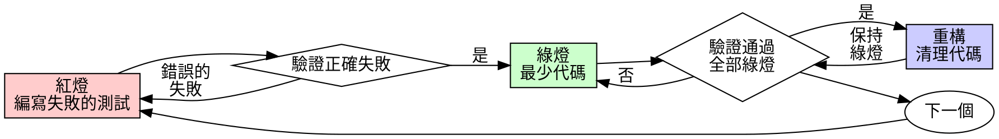

# 測試驅動開發（TDD）

## 概述

先寫測試。看它失敗。寫最少的代碼讓它通過。

**核心原則：** 如果你沒有看到測試失敗，你就不知道它是否測試了正確的東西。

**違反規則的字面意思就是違反規則的精神。**

## 何時使用

**始終使用：**
- 新功能
- Bug 修復
- 重構
- 行為變更

**例外（需詢問你的人類夥伴）：**
- 一次性原型
- 生成的代碼
- 配置文件

想著"就這一次跳過 TDD"？停下來。那是在給自己找藉口。

## 鐵律

```
沒有失敗的測試，就不寫生產代碼
```

先寫了代碼再寫測試？刪掉它。從頭來過。

**沒有例外：**
- 不要保留作為"參考"
- 不要在寫測試時"改編"它
- 不要看它
- 刪除就是刪除

從測試出發，重新實現。句號。

## 紅-綠-重構



### 紅燈 - 編寫失敗的測試

寫一個最小的測試來展示期望行為。

<Good>
```typescript
test('retries failed operations 3 times', async () => {
  let attempts = 0;
  const operation = () => {
    attempts++;
    if (attempts < 3) throw new Error('fail');
    return 'success';
  };

  const result = await retryOperation(operation);

  expect(result).toBe('success');
  expect(attempts).toBe(3);
});
```
名稱清晰，測試真實行為，只測一件事
</Good>

<Bad>
```typescript
test('retry works', async () => {
  const mock = jest.fn()
    .mockRejectedValueOnce(new Error())
    .mockRejectedValueOnce(new Error())
    .mockResolvedValueOnce('success');
  await retryOperation(mock);
  expect(mock).toHaveBeenCalledTimes(3);
});
```
名稱模糊，測試的是 mock 而非代碼
</Bad>

**要求：**
- 一個行為
- 清晰的名稱
- 使用真實代碼（除非不得已才用 mock）

### 驗證紅燈 - 看它失敗

**必須執行。絕不跳過。**

```bash
npm test path/to/test.test.ts
```

確認：
- 測試失敗（不是報錯）
- 失敗信息符合預期
- 失敗原因是功能缺失（不是拼寫錯誤）

**測試通過了？** 你在測試已有的行為。修改測試。

**測試報錯了？** 修復錯誤，重新運行直到它正確地失敗。

### 綠燈 - 最少代碼

寫最簡單的代碼讓測試通過。

<Good>
```typescript
async function retryOperation<T>(fn: () => Promise<T>): Promise<T> {
  for (let i = 0; i < 3; i++) {
    try {
      return await fn();
    } catch (e) {
      if (i === 2) throw e;
    }
  }
  throw new Error('unreachable');
}
```
剛好夠通過測試
</Good>

<Bad>
```typescript
async function retryOperation<T>(
  fn: () => Promise<T>,
  options?: {
    maxRetries?: number;
    backoff?: 'linear' | 'exponential';
    onRetry?: (attempt: number) => void;
  }
): Promise<T> {
  // YAGNI
}
```
過度設計
</Bad>

不要添加功能、重構其他代碼或做超出測試要求的"改進"。

### 驗證綠燈 - 看它通過

**必須執行。**

```bash
npm test path/to/test.test.ts
```

確認：
- 測試通過
- 其他測試仍然通過
- 輸出乾淨（沒有錯誤、警告）

**測試失敗了？** 修改代碼，不是測試。

**其他測試失敗了？** 立即修復。

### 重構 - 清理代碼

只有在綠燈之後才重構：
- 消除重複
- 改善命名
- 提取輔助函數

保持測試綠燈。不要添加行為。

### 重複

為下一個功能寫下一個失敗的測試。

## 好的測試

| 特質 | 好的 | 差的 |
|------|------|------|
| **最小化** | 只測一件事。名稱中有"和"？拆分它。 | `test('validates email and domain and whitespace')` |
| **清晰** | 名稱描述行為 | `test('test1')` |
| **展示意圖** | 展示期望的 API | 掩蓋了代碼應該做什麼 |

寫任何測試、或修改任何測試時，閱讀 [writing-good-tests.md](writing-good-tests.md)，那裡是讓測試保持誠實的規則：
- 在動手寫之前，先點名那個會讓該測試失敗的生產代碼改動
- 斷言真實行為，絕不斷言 mock 行為
- 只有測試才用的代碼放在測試工具裡，不進生產類
- 在 mock 一個依賴之前，先搞清它的副作用

## 常見藉口

| 藉口 | 現實 |
|------|------|
| "太簡單了不用測" | 簡單的代碼也會出 bug。測試只需 30 秒。 |
| "我之後補測試" | 後寫的測試立即通過——而立即通過什麼都證明不了。它可能測錯了對象、測的是實現而不是行為、或者漏掉你忘了的那個邊界情況。你從沒看著它失敗過，所以你從沒證明它能抓住 bug。先寫測試逼你看到那次失敗。 |
| "後補測試也能達到相同目的（重的是精神不是儀式）" | 後補測試回答的是"這做了什麼？"；先寫測試回答的是"這應該做什麼？"後寫的測試已經被你寫好的代碼帶偏了——你驗證的是你**記得**的那些情況，而不是你本該**發現**的那些。有覆蓋率，沒有測試有效的證明。 |
| "已經手動測試過了" | 手動測試是臨時的：沒有記錄你覆蓋了什麼、代碼一改就沒法重跑、壓力之下極易漏掉情況。"我試的時候是好的" ≠ 全面。自動化測試每次都以同樣的方式運行。 |
| "刪除 X 小時的工作太浪費" | 沉沒成本謬誤——那些時間無論怎樣都已經花掉了。真正的選擇是：用 TDD 重寫（高置信度）vs 留著它事後補測試（低置信度、很可能有 bug）。留著你無法信任的代碼才是浪費。 |
| "留作參考，然後先寫測試" | 你會去改編它。那就是後補測試。刪除就是刪除。 |
| "需要先探索一下" | 可以。探索完了扔掉，從 TDD 開始。 |
| "測試難寫 = 設計不清楚" | 聽測試的。難以測試 = 難以使用。 |
| "TDD 會拖慢我" | TDD **就是**務實的那條路：在提交前抓住 bug、防止迴歸、讓你能無所畏懼地重構。所謂"務實"的抄近道，等於在生產環境裡調試——更慢，不是更快。 |
| "手動測試更快" | 手動測試無法證明邊界情況。每次修改你都得重新測。 |
| "現有代碼沒有測試" | 你在改進它。為現有代碼補測試。 |

## 危險信號 - 停下來，從頭開始

- 先寫了代碼再寫測試
- 實現完了才補測試
- 測試立即通過
- 無法解釋測試為什麼失敗
- "之後再補"測試
- 說服自己"就這一次"
- "我已經手動測試過了"
- "後補測試也能達到相同目的"
- "重要的是精神不是儀式"
- "留作參考"或"改編現有代碼"
- "已經花了 X 小時了，刪掉太浪費"
- "TDD 太教條了，我是在務實"
- "這次情況不同，因為……"

**以上所有情況都意味著：刪除代碼。用 TDD 從頭開始。**

## 示例：Bug 修復

**Bug：** 空郵箱被接受了

**紅燈**
```typescript
test('rejects empty email', async () => {
  const result = await submitForm({ email: '' });
  expect(result.error).toBe('Email required');
});
```

**驗證紅燈**
```bash
$ npm test
FAIL: expected 'Email required', got undefined
```

**綠燈**
```typescript
function submitForm(data: FormData) {
  if (!data.email?.trim()) {
    return { error: 'Email required' };
  }
  // ...
}
```

**驗證綠燈**
```bash
$ npm test
PASS
```

**重構**
如果需要，提取驗證邏輯以支持多個字段。

## 驗證清單

在標記工作完成之前：

- [ ] 每個新函數/方法都有測試
- [ ] 在實現之前看到每個測試失敗
- [ ] 每個測試因預期原因失敗（功能缺失，不是拼寫錯誤）
- [ ] 為每個測試編寫了最少代碼使其通過
- [ ] 所有測試通過
- [ ] 輸出乾淨（沒有錯誤、警告）
- [ ] 測試使用真實代碼（只在不可避免時用 mock）
- [ ] 覆蓋了邊界情況和錯誤場景

不能全部勾選？你跳過了 TDD。從頭開始。

## 遇到困難時

| 問題 | 解決方案 |
|------|----------|
| 不知道怎麼測試 | 寫出你期望的 API。先寫斷言。問你的人類夥伴。 |
| 測試太複雜 | 設計太複雜。簡化接口。 |
| 必須 mock 所有東西 | 代碼耦合太緊。使用依賴注入。 |
| 測試 setup 太龐大 | 提取輔助函數。還是複雜？簡化設計。 |

## 調試集成

發現 bug？寫一個重現 bug 的失敗測試。按 TDD 循環走。測試既證明了修復有效，又防止了迴歸。

絕不在沒有測試的情況下修復 bug。

## 最終規則

```
生產代碼 → 測試存在且先失敗
否則 → 不是 TDD
```

沒有你的人類夥伴的許可，沒有例外。
