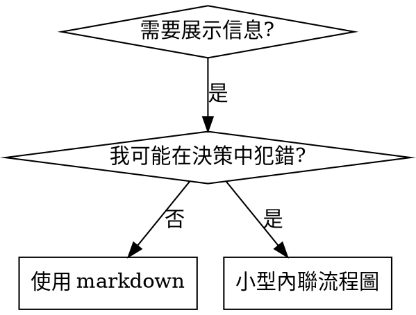

# 編寫技能

## 概述

**編寫技能就是將測試驅動開發應用於流程文檔。**

**個人技能存放在智能體特定的目錄中（Claude Code 用 `~/.claude/skills`，Codex 用 `~/.agents/skills/`）**

你編寫測試用例（帶子智能體的壓力場景），觀察它們失敗（基線行為），編寫技能（文檔），觀察測試通過（智能體遵守規則），然後重構（堵住漏洞）。

**核心原則：** 如果你沒有觀察到智能體在沒有該技能時失敗，你就不知道這個技能是否教了正確的東西。

**必需背景：** 在使用此技能前，你必須理解 superpowers:test-driven-development。該技能定義了基本的紅-綠-重構循環。本技能將 TDD 適配到文檔編寫中。

**官方指南：** Anthropic 官方的技能編寫最佳實踐請參見 anthropic-best-practices.md。該文檔提供了補充本技能 TDD 導向方法的額外模式和指南。

## 什麼是技能？

**技能**是經過驗證的技術、模式或工具的參考指南。技能幫助未來的 Claude 實例找到並應用有效的方法。

**技能是：** 可複用的技術、模式、工具、參考指南

**技能不是：** 關於你某次如何解決問題的敘事

## TDD 映射到技能

| TDD 概念 | 技能創建 |
|----------|---------|
| **測試用例** | 帶子智能體的壓力場景 |
| **生產代碼** | 技能文檔（SKILL.md） |
| **測試失敗（紅）** | 智能體在沒有技能時違反規則（基線） |
| **測試通過（綠）** | 智能體在有技能時遵守規則 |
| **重構** | 在保持合規的同時堵住漏洞 |
| **先寫測試** | 在編寫技能之前先運行基線場景 |
| **觀察失敗** | 記錄智能體使用的確切合理化藉口 |
| **最小代碼** | 編寫針對那些具體違規行為的技能 |
| **觀察通過** | 驗證智能體現在遵守規則 |
| **重構循環** | 發現新的合理化藉口 → 堵住 → 重新驗證 |

整個技能創建過程遵循紅-綠-重構。

## 何時創建技能

**創建條件：**
- 技術對你來說不是直覺上顯而易見的
- 你會在不同項目中反覆引用
- 模式具有廣泛適用性（非項目特定）
- 其他人也會受益

**不要創建：**
- 一次性解決方案
- 其他地方有充分文檔的標準實踐
- 項目特定的約定（放在 CLAUDE.md 中）
- 機械性約束（如果可以用正則/驗證強制執行，就自動化——文檔留給需要判斷的場景）

## 技能類型

### 技術類
有具體步驟的方法（condition-based-waiting、root-cause-tracing）

### 模式類
思考問題的方式（flatten-with-flags、test-invariants）

### 參考類
API 文檔、語法指南、工具文檔（office docs）

## 目錄結構

```
skills/
  skill-name/
    SKILL.md              # 主參考文檔（必需）
    supporting-file.*     # 僅在需要時
```

**扁平命名空間** - 所有技能在一個可搜索的命名空間中

**分離文件的情況：**
1. **大量參考內容**（100+ 行）- API 文檔、全面的語法說明
2. **可複用工具** - 腳本、實用程序、模板

**保持內聯：**
- 原則和概念
- 代碼模式（< 50 行）
- 其他所有內容

## SKILL.md 結構

**Frontmatter（YAML）：**
- 兩個必需字段：`name` 和 `description`（完整支持字段參見 [agentskills.io/specification](https://agentskills.io/specification)）
- 總計最多 1024 字符
- `name`：只使用字母、數字和連字符（不要用括號、特殊字符）
- `description`：第三人稱，僅描述何時使用（不是做什麼）
  - 以"Use when..."開頭，聚焦於觸發條件
  - 包含具體的症狀、場景和上下文
  - **絕不總結技能的流程或工作流**（參見 SDO 章節瞭解原因）
  - 儘量控制在 500 字符以內

```markdown
---
name: Skill-Name-With-Hyphens
description: Use when [具體的觸發條件和症狀]
---

# 技能名稱

## 概述
這是什麼？用 1-2 句話說明核心原則。

## 何時使用
[如果決策不明顯，使用小型內聯流程圖]

症狀和用例的要點列表
不適用的場景

## 核心模式（技術/模式類）
前後代碼對比

## 快速參考
用於快速瀏覽常見操作的表格或要點

## 實現
簡單模式內聯代碼
大量參考或可複用工具鏈接到文件

## 常見錯誤
常見問題 + 修復方法

## 實際效果（可選）
具體結果
```


## 技能發現優化（SDO）

**發現至關重要：** 未來的 Claude 需要找到你的技能

### 1. 豐富的描述字段

**目的：** Claude 讀取描述來決定為當前任務加載哪些技能。讓它能回答："我現在應該讀這個技能嗎？"

**格式：** 以"Use when..."開頭，聚焦於觸發條件

**關鍵：描述 = 何時使用，不是技能做什麼**

描述應該只描述觸發條件。不要在描述中總結技能的流程或工作流。

**為什麼這很重要：** 測試表明，當描述總結了技能的工作流時，Claude 可能會跟隨描述而非閱讀完整的技能內容。一個寫著"任務間進行代碼審查"的描述導致 Claude 只做了一次審查，儘管技能的流程圖清楚地展示了兩次審查（先規格合規再代碼質量）。

當描述改為僅"在當前會話中執行包含獨立任務的實現計劃時使用"（無工作流摘要）時，Claude 正確地閱讀了流程圖並遵循了兩階段審查流程。

**陷阱：** 總結工作流的描述創建了 Claude 會走的捷徑。技能正文變成了 Claude 跳過的文檔。

```yaml
# 錯誤：總結了工作流 - Claude 可能會跟隨描述而非閱讀技能
description: Use when executing plans - dispatches subagent per task with code review between tasks

# 錯誤：流程細節太多
description: Use for TDD - write test first, watch it fail, write minimal code, refactor

# 正確：只有觸發條件，無工作流摘要
description: Use when executing implementation plans with independent tasks in the current session

# 正確：僅觸發條件
description: Use when implementing any feature or bugfix, before writing implementation code
```

**內容：**
- 使用具體的觸發條件、症狀和場景來表明此技能適用
- 描述問題（競態條件、行為不一致）而非語言特定的症狀（setTimeout、sleep）
- 保持觸發條件技術無關，除非技能本身是技術特定的
- 如果技能是技術特定的，在觸發條件中明確說明
- 用第三人稱寫（注入到系統提示中）
- **絕不總結技能的流程或工作流**

```yaml
# 錯誤：太抽象、模糊，未包含何時使用
description: For async testing

# 錯誤：第一人稱
description: I can help you with async tests when they're flaky

# 錯誤：提到了技術但技能並非該技術特定的
description: Use when tests use setTimeout/sleep and are flaky

# 正確：以"Use when"開頭，描述問題，無工作流
description: Use when tests have race conditions, timing dependencies, or pass/fail inconsistently

# 正確：技術特定的技能帶有明確的觸發條件
description: Use when using React Router and handling authentication redirects
```

### 2. 關鍵詞覆蓋

使用 Claude 會搜索的詞語：
- 錯誤信息："Hook timed out"、"ENOTEMPTY"、"race condition"
- 症狀："flaky"、"hanging"、"zombie"、"pollution"
- 同義詞："timeout/hang/freeze"、"cleanup/teardown/afterEach"
- 工具：實際命令、庫名稱、文件類型

### 3. 描述性命名

**使用主動語態，動詞優先：**
- ✅ `creating-skills` 而非 `skill-creation`
- ✅ `condition-based-waiting` 而非 `async-test-helpers`

### 4. Token 效率（關鍵）

**問題：** getting-started 和頻繁引用的技能會加載到每個對話中。每個 token 都很重要。

**目標字數：**
- getting-started 工作流：每個 <150 詞
- 頻繁加載的技能：總計 <200 詞
- 其他技能：<500 詞（仍要簡潔）

**技巧：**

**將細節移到工具幫助中：**
```bash
# 錯誤：在 SKILL.md 中列出所有參數
search-conversations supports --text, --both, --after DATE, --before DATE, --limit N

# 正確：引用 --help
search-conversations 支持多種模式和過濾器。運行 --help 查看詳情。
```

**使用交叉引用：**
```markdown
# 錯誤：重複工作流細節
搜索時，用模板分派子智能體……
[20 行重複的說明]

# 正確：引用其他技能
始終使用子智能體（節省 50-100 倍上下文）。必需：使用 [other-skill-name] 工作流。
```

**壓縮示例：**
```markdown
# 錯誤：冗長的示例（42 詞）
你的搭檔："我們之前是怎麼處理 React Router 中的認證錯誤的？"
你：我來搜索過去對話中的 React Router 認證模式。
[用搜索查詢分派子智能體："React Router authentication error handling 401"]

# 正確：精簡的示例（20 詞）
搭檔："我們之前是怎麼處理 React Router 中的認證錯誤的？"
你：正在搜索……
[分派子智能體 → 整合]
```

**消除冗餘：**
- 不要重複交叉引用的技能中已有的內容
- 不要解釋從命令中就能看出的東西
- 不要為同一模式提供多個示例

**驗證：**
```bash
wc -w skills/path/SKILL.md
# getting-started 工作流：目標 <150 每個
# 其他頻繁加載的：目標總計 <200
```

**用你做的事或核心洞察來命名：**
- ✅ `condition-based-waiting` > `async-test-helpers`
- ✅ `using-skills` 而非 `skill-usage`
- ✅ `flatten-with-flags` > `data-structure-refactoring`
- ✅ `root-cause-tracing` > `debugging-techniques`

**動名詞（-ing）適合描述流程：**
- `creating-skills`、`testing-skills`、`debugging-with-logs`
- 主動的，描述你正在進行的操作

### 5. 交叉引用其他技能

**編寫引用其他技能的文檔時：**

僅使用技能名稱，帶有明確的必需標記：
- ✅ 好的：`**必需子技能：** 使用 superpowers:test-driven-development`
- ✅ 好的：`**必需背景：** 你必須理解 superpowers:systematic-debugging`
- ❌ 差的：`參見 skills/testing/test-driven-development`（不清楚是否必需）
- ❌ 差的：`@skills/testing/test-driven-development/SKILL.md`（強制加載，浪費上下文）

**為什麼不用 @ 鏈接：** `@` 語法會立即強制加載文件，在你需要之前就消耗 200k+ 的上下文。

## 流程圖使用



**僅在以下情況使用流程圖：**
- 非顯而易見的決策點
- 你可能過早停止的流程循環
- "何時使用 A vs B"的決策

**絕不使用流程圖用於：**
- 參考資料 → 表格、列表
- 代碼示例 → Markdown 代碼塊
- 線性指令 → 編號列表
- 無語義意義的標籤（step1、helper2）

參見 @graphviz-conventions.dot 瞭解 graphviz 樣式規則。

**為你的搭檔可視化：** 使用此目錄中的 `render-graphs.js` 將技能的流程圖渲染為 SVG：
```bash
./render-graphs.js ../some-skill           # 每個圖表分別渲染
./render-graphs.js ../some-skill --combine # 所有圖表合併為一個 SVG
```

## 代碼示例

**一個優秀的示例勝過多個平庸的**

選擇最相關的語言：
- 測試技術 → TypeScript/JavaScript
- 系統調試 → Shell/Python
- 數據處理 → Python

**好的示例：**
- 完整可運行
- 註釋良好，解釋為什麼
- 來自真實場景
- 清晰展示模式
- 可以直接適配（不是通用模板）

**不要：**
- 用 5 種以上語言實現
- 創建填空模板
- 寫人為構造的示例

你擅長語言移植——一個優秀的示例就夠了。

## 文件組織

### 自包含技能
```
defense-in-depth/
  SKILL.md    # 所有內容內聯
```
適用場景：所有內容都能放下，無需大量參考

### 帶可複用工具的技能
```
condition-based-waiting/
  SKILL.md    # 概述 + 模式
  example.ts  # 可適配的工作代碼
```
適用場景：工具是可複用的代碼，不只是敘述

### 帶大量參考的技能
```
pptx/
  SKILL.md       # 概述 + 工作流
  pptxgenjs.md   # 600 行 API 參考
  ooxml.md       # 500 行 XML 結構
  scripts/       # 可執行工具
```
適用場景：參考資料太多無法內聯

## 鐵律（與 TDD 相同）

```
沒有失敗的測試就不寫技能
```

這適用於新技能和對現有技能的編輯。

先寫技能再測試？刪掉它。重新開始。
編輯技能不測試？同樣違規。

**無例外：**
- 不適用於"簡單的添加"
- 不適用於"只是加一個章節"
- 不適用於"文檔更新"
- 不要保留未測試的更改作為"參考"
- 不要在運行測試時"調整"
- 刪除就是刪除

**必需背景：** superpowers:test-driven-development 技能解釋了為什麼這很重要。相同的原則適用於文檔。

## 測試所有技能類型

不同類型的技能需要不同的測試方法：

### 紀律執行類技能（規則/要求）

**例如：** TDD、完成前驗證、編碼前設計

**測試方式：**
- 學術性問題：它們理解規則嗎？
- 壓力場景：它們在壓力下遵守嗎？
- 多重壓力組合：時間 + 沉沒成本 + 疲憊
- 識別合理化藉口並添加明確的反駁

**成功標準：** 智能體在最大壓力下遵循規則

### 技術類技能（操作指南）

**例如：** condition-based-waiting、root-cause-tracing、defensive-programming

**測試方式：**
- 應用場景：它們能正確應用技術嗎？
- 變體場景：它們能處理邊界情況嗎？
- 缺失信息測試：說明是否有遺漏？

**成功標準：** 智能體成功將技術應用於新場景

### 模式類技能（心智模型）

**例如：** reducing-complexity、information-hiding 概念

**測試方式：**
- 識別場景：它們能識別模式何時適用嗎？
- 應用場景：它們能使用心智模型嗎？
- 反例：它們知道何時不應用嗎？

**成功標準：** 智能體正確識別何時/如何應用模式

### 參考類技能（文檔/API）

**例如：** API 文檔、命令參考、庫指南

**測試方式：**
- 檢索場景：它們能找到正確的信息嗎？
- 應用場景：它們能正確使用找到的內容嗎？
- 覆蓋測試：常見用例是否都涵蓋了？

**成功標準：** 智能體找到並正確應用參考信息

## 跳過測試的常見合理化藉口

| 藉口 | 現實 |
|------|------|
| "技能顯然很清晰" | 對你清晰 ≠ 對其他智能體清晰。測試它。 |
| "這只是參考資料" | 參考資料可能有遺漏、不清楚的地方。測試檢索。 |
| "測試太過了" | 未測試的技能總有問題。15 分鐘測試省下數小時。 |
| "有問題再測試" | 問題 = 智能體無法使用技能。在部署前測試。 |
| "測試太繁瑣" | 測試比在生產中調試壞技能少繁瑣得多。 |
| "我有信心它很好" | 過度自信保證出問題。無論如何都要測試。 |
| "學術審查就夠了" | 閱讀 ≠ 使用。測試應用場景。 |
| "沒時間測試" | 部署未測試的技能比後面修復浪費更多時間。 |

**以上所有都意味著：部署前測試。無例外。**

## 讓形式匹配失敗類型

在寫指導內容之前，先給基線失敗**歸類**。能讓某一類失敗變得無懈可擊的形式，用在另一類上會**可測量地反噬**。

| 基線失敗 | 正確的形式 | 錯誤的形式 |
|---|---|---|
| 壓力之下跳過/違反規則（明知故犯） | 禁令 + 合理化藉口表 + 紅線（見下方"讓技能經受住合理化的考驗"） | 軟性建議（"優先……"、"考慮……"） |
| 遵守了，但產出的**形狀**不對（提示詞臃腫、結論被埋、複述規格） | 正面配方或契約：直接說明產出**是什麼** —— 它由哪些部分組成、按什麼順序 | 禁令清單（"不要複述"、"絕不旁白"） |
| 在他們**本來就會產出**的東西裡漏掉了必需元素 | 結構性手段：在他們要填的模板裡放一個 REQUIRED 字段或佔位槽 | 在模板附近寫散文式提醒 |
| 行為**應當取決於某個條件** | 掛在可觀察謂詞上的條件句（"如果簡報存在，就引用它"） | 無條件規則 + 一堆例外條款 |

**為什麼禁令在"塑形"類問題上會反噬：** 在存在競爭性激勵時（比如"讓提示詞自包含"），智能體會**跟"不要 X"討價還價**。在針對分派提示詞指導做的同題措辭對照測試裡，禁令組產出的不想要的內容明顯**多於**配方組（兩組分佈完全分離），甚至比"完全不給指導"的對照組還差 —— 請對你自己的場景做微型測試，別想當然，但**永遠不要把禁令當默認選擇**。配方留不下可討價還價的空間：產出要麼符合所說的形狀，要麼不符合。

**無論你選哪種形式，都適用的規則：**
- **不要加"視情況"從句。** "不要 X，除非它很重要"會重新打開談判 —— 在同一批措辭測試裡，給一個勝出的配方追加**一條**"視情況"從句，就把它從穩定退化成了飄忽。真正的例外要表達成**它自己的**條件句，掛在可觀察的謂詞上。
- **豁免條款不會限定作用域。** "這條長度限制不適用於代碼塊"，照樣會壓制代碼塊。如果產出裡有一部分必須豁免，就**重構結構讓規則碰不到它**，而不是寫豁免。

## 讓技能經受住合理化的考驗

執行紀律的技能（如 TDD）需要抵抗合理化。智能體很聰明，在壓力下會找到漏洞。

**心理學說明：** 理解說服技巧為什麼有效有助於你系統性地應用它們。參見 persuasion-principles.md 瞭解研究基礎（Cialdini, 2021; Meincke et al., 2025），涵蓋權威、承諾、稀缺、社會認同和歸屬原則。

### 明確堵住每個漏洞

不要只是陳述規則——禁止具體的變通方法：

<Bad>
```markdown
先寫代碼再寫測試？刪掉它。
```
</Bad>

<Good>
```markdown
先寫代碼再寫測試？刪掉它。重新開始。

**無例外：**
- 不要保留作為"參考"
- 不要在寫測試時"調整"它
- 不要看它
- 刪除就是刪除
```
</Good>

### 應對"精神 vs 字面"的辯論

在前面加入基礎原則：

```markdown
**違反規則的字面意思就是違反規則的精神。**
```

這切斷了整類"我遵循的是精神"的合理化藉口。

### 構建合理化藉口表

從基線測試中捕獲合理化藉口（參見下方測試章節）。智能體使用的每個藉口都進入表中：

```markdown
| 藉口 | 現實 |
|------|------|
| "太簡單不值得測試" | 簡單的代碼也會出錯。測試只需 30 秒。 |
| "我後面再測試" | 測試立即通過什麼也證明不了。 |
| "後寫測試效果一樣" | 後寫測試 = "這做了什麼？" 先寫測試 = "這應該做什麼？" |
```

### 創建紅線列表

讓智能體容易自查是否在合理化：

```markdown
## 紅線 - 停下來重新開始

- 先寫代碼再寫測試
- "我已經手動測試過了"
- "後寫測試效果一樣"
- "重要的是精神不是儀式"
- "這個情況不同，因為……"

**以上所有都意味著：刪除代碼。用 TDD 重新開始。**
```

### 更新 SDO 以包含違規症狀

在描述中添加：你即將違反規則時的症狀：

```yaml
description: use when implementing any feature or bugfix, before writing implementation code
```

## 技能的紅-綠-重構

遵循 TDD 循環：

### 紅：編寫失敗的測試（基線）

在沒有技能的情況下運行壓力場景。逐字記錄行為：
- 它們做了什麼選擇？
- 它們使用了什麼合理化藉口（原文）？
- 哪些壓力觸發了違規？

這就是"觀察測試失敗"——在編寫技能之前你必須看到智能體自然會怎麼做。

### 綠：編寫最小技能

編寫針對那些具體合理化藉口的技能。不要為假設情況添加額外內容。

用技能運行相同的場景。智能體應該現在遵守。

### 重構：堵住漏洞

智能體找到了新的合理化藉口？添加明確的反駁。重新測試直到無懈可擊。

### 先做措辭微型測試，再跑完整場景

完整的壓力場景是最後一道關卡，但它每輪迭代都又慢又貴。先用**微型測試**驗證措辭本身：

1. **每次調用一個全新上下文的樣本** —— 一次裸 API 調用，或者沒有 API 權限時用一個單發子智能體。system prompt 放**這條指導實際會存在的真實上下文**（完整的 skill 或提示詞模板，不是把指導單獨拎出來）；user message 放一個會**誘發該失敗**的任務。
2. **永遠帶一個"不給指導"的對照組。** 如果對照組根本沒表現出那個失敗，那就沒什麼可修的 —— 停下，別寫這條指導。
3. **每個變體至少 5 次重複。** 單個樣本會騙人。
4. **每一條被標記的命中都要人工讀一遍。** 想用程序打分可以，但模板回聲和被引用的反例會**偽裝成命中**；只看自動計數會同時高估失敗和成功。
5. **方差本身就是一個指標。** 指導真正生效時，多次重複會收斂到同一種形狀。5 次重複出現 5 種不同解讀，說明這個措辭**沒有約束力** —— 先收緊形式，別急著加字。

微型測試驗證的是**措辭**；對紀律執行類技能，它**不能替代**壓力場景。

**測試方法論：** 參見 @testing-skills-with-subagents.md 瞭解完整的測試方法：
- 如何編寫壓力場景
- 壓力類型（時間、沉沒成本、權威、疲憊）
- 系統地堵住漏洞
- 元測試技巧

## 反模式

### 敘事式示例
"在 2025-10-03 的會話中，我們發現空的 projectDir 導致了……"
**為什麼不好：** 太具體，不可複用

### 多語言稀釋
example-js.js、example-py.py、example-go.go
**為什麼不好：** 質量平庸，維護負擔重

### 流程圖中的代碼
```dot
step1 [label="import fs"];
step2 [label="read file"];
```
**為什麼不好：** 無法複製粘貼，難以閱讀

### 通用標籤
helper1、helper2、step3、pattern4
**為什麼不好：** 標籤應有語義意義

## 停下：進入下一個技能之前

**編寫任何技能後，你必須停下來完成部署流程。**

**不要：**
- 批量創建多個技能而不逐個測試
- 在當前技能驗證前就進入下一個
- 因為"批量處理更高效"就跳過測試

**下面的部署清單對每個技能都是強制性的。**

部署未測試的技能 = 部署未測試的代碼。這是對質量標準的違反。

## 技能創建清單（TDD 適配版）

**重要：使用 TodoWrite 為下面的每個清單項創建待辦。**

**紅色階段 - 編寫失敗的測試：**
- [ ] 創建壓力場景（紀律類技能需 3 個以上組合壓力）
- [ ] 在沒有技能的情況下運行場景 - 逐字記錄基線行為
- [ ] 識別合理化藉口中的模式

**綠色階段 - 編寫最小技能：**
- [ ] 名稱只使用字母、數字、連字符（無括號/特殊字符）
- [ ] YAML frontmatter 包含必需的 `name` 和 `description` 字段（最多 1024 字符；參見 [spec](https://agentskills.io/specification)）
- [ ] 描述以"Use when..."開頭幷包含具體的觸發條件/症狀
- [ ] 描述用第三人稱
- [ ] 全文包含搜索關鍵詞（錯誤、症狀、工具）
- [ ] 帶有核心原則的清晰概述
- [ ] 解決紅色階段識別出的具體基線失敗
- [ ] 代碼內聯或鏈接到獨立文件
- [ ] 一個優秀的示例（非多語言）
- [ ] 用技能運行場景 - 驗證智能體現在遵守

**重構階段 - 堵住漏洞：**
- [ ] 從測試中識別新的合理化藉口
- [ ] 添加明確的反駁（紀律類技能）
- [ ] 從所有測試迭代中構建合理化藉口表
- [ ] 創建紅線列表
- [ ] 重新測試直到無懈可擊

**質量檢查：**
- [ ] 僅在決策不明顯時使用小流程圖
- [ ] 快速參考表
- [ ] 常見錯誤章節
- [ ] 無敘事性故事
- [ ] 支持文件僅用於工具或大量參考

**部署：**
- [ ] 將技能提交到 git 並推送到你的 fork（如果已配置）
- [ ] 考慮通過 PR 貢獻回去（如果具有廣泛用途）

## 發現工作流

未來的 Claude 如何找到你的技能：

1. **遇到問題**（"測試不穩定"）
3. **找到技能**（描述匹配）
4. **瀏覽概述**（這相關嗎？）
5. **閱讀模式**（快速參考表）
6. **加載示例**（僅在實現時）

**為此流程優化** - 把可搜索的術語放在前面和各處。

